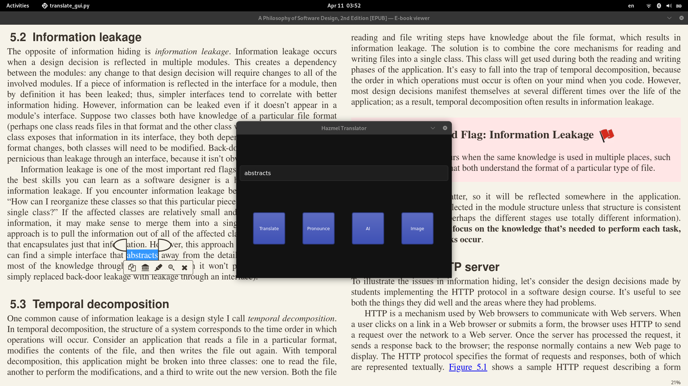

# Hazmel Explain

Translation popup tool directed to help you while reading

## Usage
start the backend fastAPI server

add a shortcut to run translate_gui_lanch.sh

it will give options for the selected word
between translate, pronounce, image search, ask ai

## Project Structure
Backend -> FastAPI
Frontend -> pyQT5
